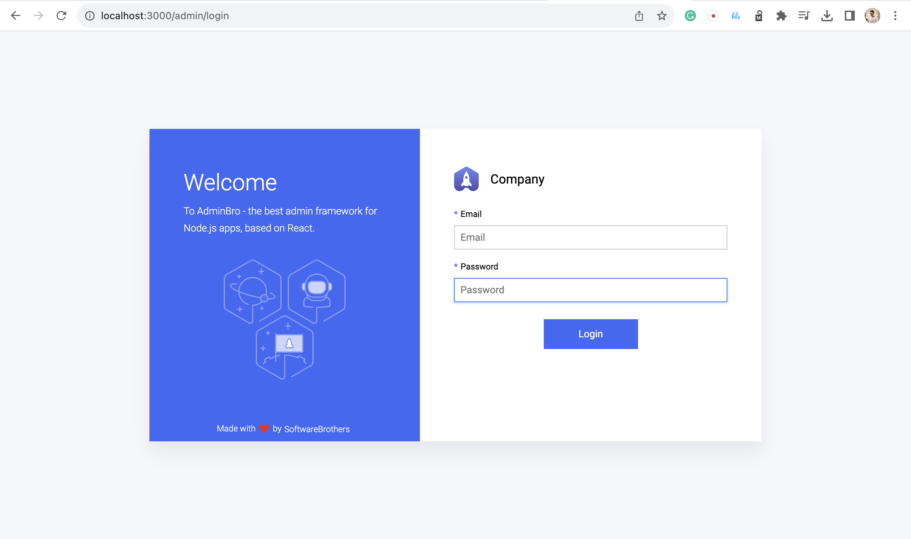
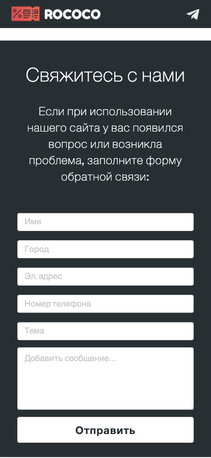

# Rococo: Coupon and Sale Aggregator

## About

Rococo is a dynamic, user-centric website designed to aggregate and systematically display coupons and active sales, providing users with a seamless and efficient way to access the latest deals.






## Features

- **Admin Dashboard:** Integrated AdminBro for a simplified and efficient administrative workflow, aiding in the management of database records.
- **User Engagement:** Enhanced user interactivity with visually appealing design elements and intuitive navigation structures.
- **Responsive Design:** Optimized for responsiveness and cross-browser compatibility, ensuring accessibility across various devices and browsers.

## Setup

### Prerequisites

- Node.js
- MongoDB

### Installation

1. Clone the repository:
   ```bash
   git clone https://github.com/MuratovArthur/Rococo.git
   ```
2. Navigate to the project directory:
   ```bash
   cd Rococo
   ```
3. Install dependencies:
   ```bash
   npm install
   ```
4. Set up environment variables in a `.env` file in the root directory. Example:
   ```env
   databaseURL=database_url
   AD_EMAIL=admin_emaiil
   AD_PASS=admin_password
   PASS=path_to_admin
   ```
5. Run the application:
   ```bash
   node app.js
   ```

### Usage
Navigate to http://localhost:3000 on your browser to access the website.

For administration, access the admin dashboard at http://localhost:3000/admin.
